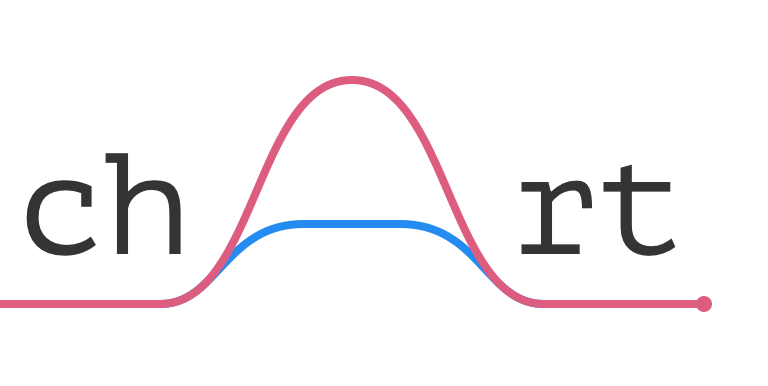
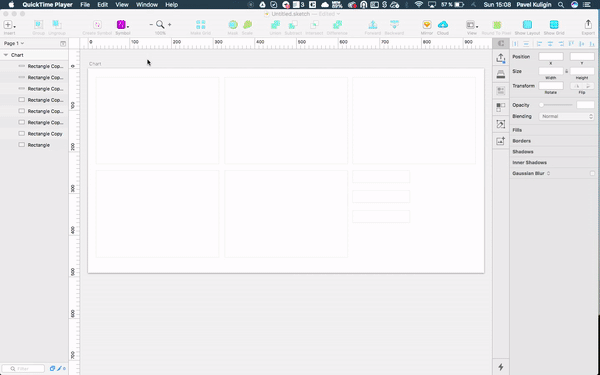

Chart is a Sketch plugin for creation the most popular charts by real or random data. Chart supports copy-paste from any kind of text editor, for example: Notes, Word, Google Docs, etc. Also Chart supports copy-paste tabulated data from Google Sheets or Microsoft Excel.

[Read more on Medium](https://medium.com/@pavelkuligin/chart-the-most-powerful-data-visualization-plugin-for-sketch-6849155e09ab)



### Steps

1. Draw Rectangle or Oval. 
2. Copy numeric or use random data. You can select a few strings of numbers 
to create a few lines, areas, bars, sparklines or progress bars. Supported formats:
   - 10, 12, 14, 16;
   - 5.3, 7.9, 15.3, 20.1;
   - 25%, 30%, 10%, 35%;
   - row in Google Sheets or Excel.

3. Select Rectangle.
4. Create Chart using Plugins menu or Sketch Runner :-)


## Install

### Via Sketchpacks

[](https://sketchpacks.com/pavelkuligin/chart/install)

### Or manually

1. Download and unzip: [chart-master.zip](https://github.com/pavelkuligin/chart/archive/master.zip).
2. Double click `Chart.sketchplugin`.


## Parameters

Open `Parameter.js` in Chart.sketchplugin/Contents/Sketch/ and change plugin's parameters as you want. [Read more on Medium](https://medium.com/sketch-app-sources/chart-2-6-a-lot-of-new-visualizations-negative-values-and-more-flexible-parameters-466eeb884da1)

```javascript
// Type of line: straight — 0, curved — 1
var curveType = 1;

// Set of colors for lines
var colorPalette = new Array();
	var red = [244,67,54];
	var pink = [233,30,99];
	var purple = [156,39,176];
	var deepPurple = [103,58,183];
	var blue = [33,150,243];
	var cian = [0,188,212];
	var teal = [0,150,136];
	var green = [0,200,83];
	var yellow = [255,235,59];
	var amber = [255,193,7];
	var orange = [255,152,0];

	colorPalette = [red, green, blue, yellow, purple, pink, amber, cian, deepPurple, teal, orange];

// Parameters for Lines
var borderThickness = 2;
var endWidth = 8;
var dots = false;
var cuttedCenter = false; // false — color of dot the same as line color; true — you can choose color of dot and dot border below;
var dotFillR = 255;
var dotFillG = 255;
var dotFillB = 255;  
var dotBorderR = 255;
var dotBorderG = 255;
var dotBorderB = 255; 

// Parameters for Areas
var areaOpacity = 0.8; 

// Parameters for Bars
var barWidthParam = 0.2; // The larger the parameter, the thinner the bar;

// Parameters for Donut
var donutBorder = 30;

// Parameters for Progress bar
var progressBarBorder = 12;
var progressBarColor = [244,67,54];

// Parameters for Gauge chart
var gaugeChartBorder = 30;
var gaugeChartColor = [156,39,176];
var gaugeChartBackcolor = [236,236,236];

// Parameters for Sparklines
var sparkColor = [52,52,52];
var borderThicknessSpark = 1;
var endWidthSpark = 4;
var sparkPointsCount = 20;
```


### Roadmap

- [x] Line Chart
- [x] Bar Chart
- [x] Area Chart
- [x] Stacked Area Chart
- [x] Sparkline
- [x] New random data generation algorithm
- [x] Pie Chart
- [x] Donut Chart
- [x] Progress Bar
- [x] Solid Gauge Chart
- [x] Stream Graph
- [ ] Bubble Chart (Feb 2018)
- [ ] Candlestick Chart (Mar 2018)

### Support Chart

If Chart saves your time and you want more new features, [support me via PayPal](https://www.paypal.me/pavelkuligin/5usd).


### Contact me

If you have any questions or ideas about Chart, please, feel free to contact me:
pavel.kuligin@behavox.com, www.pavelkuligin.ru or [facebook](https://www.facebook.com/kuligin.pavel)

